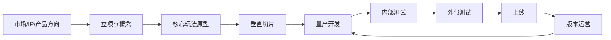

# 游戏开发全流程

游戏开发要分成两层看：

1. **整个项目生命周期**：立项 → 原型 → 垂直切片 → 量产 → 测试 → 上线 → 长线运营。
2. **日常做一个功能的流程**：提需求 → 评审 → 拆任务 → 开发 → 联调 → 测试 → 验收 → 发布。

抖音视频讲的普通软件开发流程，主要对应第二层；游戏公司是在这套流程中加入玩法验证、数值配置、美术资源、关卡制作和多端性能等环节。

## 一、整个项目从立项到上线

### 1. 产品方向与立项

老板、发行、市场和制作人先确定：做什么品类、目标用户是谁、上哪些平台、靠什么收费、预算和周期是多少。

策划团队输出初步产品方案：核心体验、题材世界观、核心循环、战斗形式、养成和商业化框架。主程评估引擎、网络架构、平台和技术风险；主美确定美术风格及资源成本。

这一阶段的结果不是完整游戏，而是决定“值不值得继续投钱”。

### 2. 预研与核心玩法原型

策划先用纸面、Excel、脚本或灰盒搭出最小玩法；程序快速实现角色移动、战斗、相机、网络等关键能力，美术只做临时资源。

目标是验证核心乐趣和技术可行性。例如动作游戏先验证移动、攻击、受击、技能和 Boss，而不是先做完整主城和几十套养成。

### 3. 垂直切片（Vertical Slice）

选择一个完整关卡或一小段正式内容，按照最终上线品质制作。这里要把策划、程序、美术、动画、特效、音频和测试真正串起来。

它相当于“精装修样板间”：既验证最终品质，也验证团队管线、成本和量产速度。

### 4. 量产开发

垂直切片通过后，团队才大规模生产角色、关卡、任务、系统和活动。项目通常按版本或两至四周的迭代周期推进，每个功能都走“需求—开发—测试—验收”闭环。

### 5. 内部测试与外部测试

- **内部测试**：功能、数值、体验、兼容性、弱网、性能、服务器容量和安全测试。
- **技术测试／一测**：验证设备适配、服务器承载、核心玩法和新手流失。
- **二测／三测**：补内容、调数值、验证商业化和长期留存。
- **上线前**：版本锁定、合规审核、渠道 SDK、支付、登录、埋点、客服和运营预案全部确认。

### 6. 正式上线与长线运营

上线不是结束。程序监控崩溃、延迟、服务器负载和异常数据；策划分析留存、付费、关卡通过率和角色使用率，继续设计活动、新系统和新内容。发现严重问题时通过热更新、补丁或服务器开关快速处理。

## 二、日常开发一个功能的真实流程

以“新增一个三人 Boss 副本”为例：

### 1. 需求提出

系统／关卡／战斗策划先说明为什么做：解决什么体验问题、服务哪个版本目标、预期提升什么数据，而不是只说“我要一个副本”。

### 2. 策划案与验收标准

策划需要写清：

- 入口、开放条件、组队和匹配规则；
- 战斗流程、Boss 阶段、失败与结算；
- 奖励、次数、掉落和经济影响；
- UI 流程、提示、断线重连和异常情况；
- 埋点需求及“做到什么程度算完成”。

没有异常流程和验收标准的策划案，程序即使把功能做出来，也很容易反复返工。

### 3. 需求评审

制作人、主策、程序、美术、测试、运营一起评审：玩法是否值得做、规则是否有漏洞、资源是否来得及、技术风险多大、能否按版本上线。

评审后可能直接砍需求、缩范围或分期实现。

### 4. 技术方案与任务拆分

程序负责人决定怎么实现，并拆成客户端、服务端、工具和数据任务：

- 客户端：副本界面、角色表现、Boss 技能、相机、动画和特效接入；
- 服务端：组队匹配、房间、战斗状态、掉落和结算；
- 工具／编辑器：让策划能够配置 Boss、关卡、奖励和触发器；
- 测试开发：自动化、压测脚本和数据检查工具。

然后评估人日、依赖关系和风险，排入版本计划。

### 5. 并行制作

- **策划**：配表、搭灰盒关卡、配置技能和奖励、跟进资源并持续试玩。
- **程序**：拉开发分支、写代码、接口和工具，补日志及异常保护。
- **美术／动画／特效／音频**：按资源规范生产并提交资产。
- **项目经理**：跟进依赖、风险和里程碑，处理资源冲突。

不是策划写完文档就等结果，开发过程中双方会不断确认细节。

### 6. 自测、代码评审与合并

程序先做单元测试或功能自测，确认正常路径和关键异常；其他程序进行 Code Review，检查逻辑、性能、安全和代码规范。通过后合并到版本分支，由构建系统生成可测试版本。

### 7. 联调

客户端、服务端、策划配置和正式资源接到一起。常见问题包括字段理解不一致、时序错误、断线状态不同步、资源命名错误和表现与判定不一致。

### 8. QA 测试与修 Bug

测试根据用例验证正常流程、边界条件、弱网、多人并发、机型兼容和性能。Bug 按严重程度分配给策划、程序或美术修复，修完后测试回归，确认没有引入新问题。

### 9. 策划验收与版本验收

测试通过不等于体验合格。策划检查玩法、手感、数值和演出是否达到目标；制作人／主策进行版本级验收，决定上线、延期还是砍掉。

### 10. 封版、发布与监控

版本进入 Code Freeze／Content Lock，只允许修阻塞问题。完成最终回归后生成 Release Candidate，按渠道提审或灰度发布。上线后重点观察崩溃率、登录、延迟、匹配、付费、通过率和玩家反馈，并准备热修。

## 三、策划和程序分别负责什么

| 角色 | 核心责任 | 典型产出 |
| --- | --- | --- |
| 制作人 | 决定产品方向、预算、品质和取舍 | 立项目标、版本优先级、最终验收 |
| 主策划 | 统一玩法框架并管理策划团队 | 系统框架、版本内容、策划规范 |
| 系统策划 | 设计功能规则与交互流程 | 策划案、流程图、配置表、验收标准 |
| 数值策划 | 战斗、成长、经济和商业化数值 | 数值模型、投放回收、平衡方案 |
| 战斗／关卡策划 | 战斗机制、角色技能、Boss 和关卡体验 | 技能配置、灰盒、关卡脚本、体验调优 |
| 客户端程序 | 玩家看到和操作的功能 | 战斗、UI、动画、相机、资源和性能 |
| 服务端程序 | 权威逻辑、多人状态和数据安全 | 网关、房间、匹配、结算、数据库 |
| 引擎／工具程序 | 底层能力及生产工具 | 编辑器、资源管线、构建、渲染和性能工具 |
| 测试 | 发现问题并控制版本质量 | 用例、Bug、回归、兼容和性能报告 |

## 四、最容易理解错的地方

1. **策划不是只提想法**：还要写规则、做配置、跟资源、试玩、验收和看数据。
2. **程序不是只照文档写代码**：还要设计技术方案、评估风险、处理异常、做工具、联调和线上排障。
3. **测试不是最后才进入**：需求评审阶段就应参与，否则到最后才发现规则不可测或异常流程缺失。
4. **开发不是瀑布式接力**：策划、程序、美术和测试大部分时间并行工作，通过版本节点不断对齐。
5. **上线不代表完成**：在线游戏通常是“版本开发—测试—上线—数据复盘”的长期循环。

## 五、一句话总结

游戏开发不是“策划想好，程序做完”这么简单，而是：**策划定义目标和规则，程序设计可运行的实现，美术提供内容表现，测试控制质量，大家围绕同一个版本反复评审、联调、验收和迭代。**
