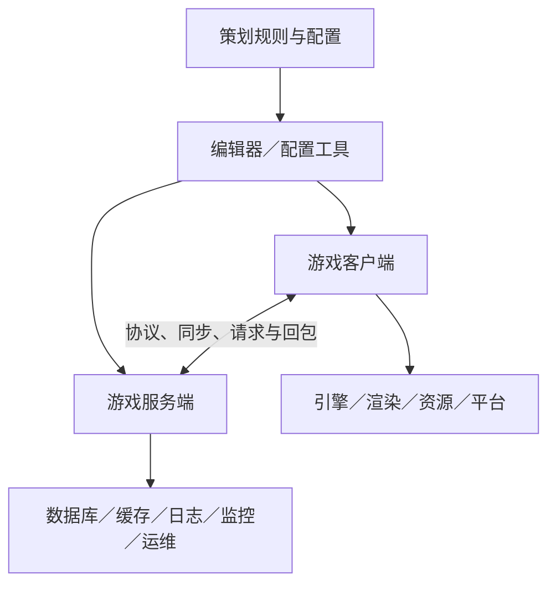

# 游戏程序团队如何从 0 到 1 研发新游戏

## 核心结论

程序团队不是拿到一份完整策划案后，所有人一起开始“堆代码”。真实情况是：**主程先根据游戏类型和产品目标搭技术骨架，把游戏拆成客户端、服务端、引擎底层、工具与基础设施等模块；各模块负责人再继续拆成接口和任务，由每名程序负责一个可以独立交付的模块，最后通过协议、数据和版本分支持续集成。**

并不是每个人都负责整体架构：

- 制作人、主策决定产品做什么；
- 技术负责人／主程决定技术上怎么落地、模块怎么切、风险怎么控；
- 各方向 Lead 决定本方向的内部方案和接口；
- 普通程序负责具体系统或子模块的设计、编码、自测、联调、修 Bug 和上线维护。

## 一、写代码之前，程序先确认边界

程序架构不是凭空设计，先要根据产品约束做选择：

| 产品问题 | 对技术方案的影响 |
| --- | --- |
| 单机还是在线 | 是否需要登录、网关、战斗服、数据库、反作弊和断线重连 |
| MMO、大世界还是箱庭副本 | 是否需要 AOI、分线分片、世界状态、无缝加载和动态资源调度 |
| 帧同步还是状态同步 | 战斗逻辑放哪里、带宽和延迟怎么处理、客户端能否预测 |
| 手机、PC、主机还是多端 | 引擎、画质档位、输入、平台 SDK、内存与包体预算不同 |
| 预计 DAU／CCU | 服务器拆分、扩缩容、数据库、缓存和容灾方案不同 |
| 是否长期运营 | 是否需要热更新、配置中心、活动框架、埋点、GM 和监控告警 |
| 内容量和更新频率 | 是否需要编辑器、自动化校验、资源管线和构建农场 |

主程一般会先输出技术预研和架构草案，包括：引擎与语言、客户端和服务端边界、网络同步、数据存储、资源加载、热更新、模块依赖、工具链、性能预算、构建发布及主要技术风险。

## 二、整体架构通常怎么拆

以一款“多人在线 3D ARPG”为例，可以粗略拆成四条线：

### 1. 客户端

负责玩家看见和操作的部分，但不只是 UI：

- **基础框架**：启动流程、模块生命周期、事件系统、配置读取、热更新；
- **战斗与玩法**：角色移动、技能、受击、相机、交互、怪物表现；
- **系统与 UI**：背包、任务、养成、商城、社交和各种界面；
- **网络表现**：协议接入、状态同步、预测、插值、断线重连；
- **资源与场景**：加载卸载、对象池、场景流送、资源依赖；
- **平台适配**：安卓／iOS／PC／主机 SDK、输入和包体；
- **性能优化**：CPU、内存、GC、加载、发热、帧率和卡顿。

### 2. 服务端

负责权威规则、多人状态和玩家数据：

- 登录、账号、网关和会话；
- 大厅、组队、匹配、房间和战斗实例；
- 角色、背包、任务、养成、经济和支付；
- 好友、公会、聊天、邮件和排行榜；
- 大世界状态、AOI、分线、跨服或世界服；
- 数据库、Redis、消息队列、日志、GM 和配置中心；
- 限流、降级、扩缩容、容灾、数据修复及线上事故处理。

在线游戏中，涉及奖励、伤害、掉落、库存和支付的关键结果通常由服务端校验或计算，不能完全相信客户端。

### 3. 引擎／底层／渲染

不直接做某个背包或活动，而是解决全项目都依赖的问题：

- 渲染管线、Shader、材质、光照和画质分级；
- 动画、物理、导航、音频和输入；
- 资源系统、场景流送、异步加载、内存管理；
- 引擎源码修改、跨平台适配、Crash 和性能分析；
- 为上层玩法提供稳定接口。

### 4. 工具与工程效率

让策划和美术可以大量生产内容，而不需要每次找程序改代码：

- 关卡、技能、AI、任务、剧情和活动编辑器；
- Excel／配置导入导出及自动校验；
- 美术资产检查、压缩和加工流水线；
- 自动构建、自动测试、包体发布和版本管理；
- Crash、日志、埋点、性能回归及可视化平台。

工具程序做得好，策划可以自己配一个怪或活动；工具做得差，每次改数值、加字段都要找程序，量产阶段会非常慢。

## 三、架构不是一次设计完，而是分阶段长出来

### 1. 原型期：先证明“好不好玩、做不做得出”

只搭最小闭环。程序可以用临时代码、假数据和灰盒资源，优先验证移动、战斗、网络同步、大世界加载等最高风险点。此时不应过度追求完美架构。

### 2. 垂直切片：把临时方案变成可量产骨架

完成一段接近正式品质的内容。主程会确认模块边界、数据驱动方式、资源规范、编辑器、网络协议和性能预算；一次性代码开始重构成可复用系统。

### 3. 量产期：稳定接口，让几十人能并行工作

重点不再是“功能能跑”，而是：改动不会牵一发动全身、策划能自行配置、美术资源能自动校验、版本每天能稳定构建。模块负责人和 Code Owner 制度在这一阶段最重要。

### 4. 上线期：补稳定性、观测和应急能力

包括压测、弱网、容灾、灰度、热修、监控告警、数据修复和回滚。能开发功能不等于能安全上线；线上项目还要求出问题时能定位、止损和恢复。

## 四、每一层的人具体负责什么

| 人员 | 主要工作 | 不只是做什么 |
| --- | --- | --- |
| 技术负责人／主程 | 技术选型、整体架构、团队分工、关键风险、规范和最终技术质量 | 不会亲自写完所有系统，而是保证各模块能接起来 |
| 客户端／服务端／引擎 Lead | 拆本方向架构、定义接口、排期、技术评审、Code Review、处理跨模块难题 | 对本方向交付负责 |
| 模块负责人 | 从技术设计到上线长期负责一个模块，如战斗、网络、任务、匹配 | 写代码外还要维护文档、性能、工具、日志和线上问题 |
| 普通程序 | 按技术方案实现功能或子模块，自测、联调、修 Bug、参与评审 | 不是机械照抄策划案，发现不可实现或有漏洞要主动反馈 |
| 初级程序 | 在明确边界和接口下完成较小任务，由负责人评审和带教 | 随经验增长逐步承担完整模块 |
| DevOps／构建／SRE | CI/CD、服务器部署、监控、扩缩容、权限、发布和事故响应 | 在线项目的可用性保障 |

团队一般同时采用两种分工：

- **横向模块制**：战斗组、系统组、引擎组、服务端组，各自长期维护公共能力；
- **纵向功能制**：为了某个版本功能临时组成小组，例如副本策划、战斗客户端、服务端、关卡和测试共同交付一个 Boss 副本。

横向保证专业和复用，纵向保证一个功能有人从头跟到上线。

## 五、一个功能具体怎么落到每个人手里

仍以“三人 Boss 副本”为例：

### 1. 需求评审

策划说明副本规则和验收标准。各方向负责人判断需要复用哪些旧模块、要新增哪些能力、有哪些技术风险。若匹配系统尚不支持三人队伍，或 Boss 需要新的网络同步能力，会在这里暴露。

### 2. 技术设计

功能负责人输出技术方案，通常至少写清：

- 模块和数据流；
- 客户端、服务端分别负责什么；
- 协议、字段、错误码和时序；
- 需要新增或修改哪些配置；
- 断线、超时、重复领奖、队长退出等异常流程；
- 性能、日志、埋点和测试方式；
- 依赖、工期、负责人及上线风险。

### 3. 拆任务和定义接口

例如：

| 人员 | 任务 |
| --- | --- |
| 客户端 A | 副本入口、匹配界面、结算界面 |
| 客户端 B | Boss 技能表现、相机、受击和特效接入 |
| 网络／战斗客户端 C | 角色同步、预测和断线恢复 |
| 服务端 D | 队伍、匹配、房间生命周期 |
| 战斗服 E | Boss 状态、伤害校验、胜负和结算 |
| 工具程序 F | Boss 行为、关卡触发器和奖励配置工具 |
| 引擎／性能 G | 场景加载、内存峰值和多人同屏性能 |

大家能并行的前提是先约好协议和接口。例如服务端暂未完成时，客户端可以用 Mock 假数据开发 UI；美术资源未完成时，程序先用占位资源验证逻辑。

### 4. 每个人独立开发

每名程序通常会：

1. 接任务并确认完成标准、接口和依赖；
2. 从版本分支拉自己的开发分支；
3. 先搭数据结构和接口，再实现主流程；
4. 补异常保护、日志、配置和调试命令；
5. 用测试场景或 Mock 数据做本地自测；
6. 自查性能、线程、内存、网络和兼容性问题；
7. 提交 Merge Request／Pull Request；
8. 由模块负责人 Code Review，修改后合并；
9. 进入自动构建，由 QA 和策划在公共版本里验收；
10. 持续修 Bug、做回归，直到上线并观察线上数据。

### 5. 联调与集成

客户端和服务端按约定协议连接，正式配置和资源逐步替换占位内容。联调最常见的问题不是“不会写代码”，而是双方对字段、时序、状态归属和异常情况理解不一致。

模块负责人负责解决跨人、跨组冲突；主程通常只介入影响整体架构、性能或版本风险的问题。

## 六、程序员一天通常怎么工作

量产阶段大致是：

1. 看构建和线上监控，确认昨天提交是否造成 Crash 或性能回退；
2. 短会同步任务、依赖和阻塞；
3. 编码、自测，或与策划确认规则；
4. 与其他程序联调接口，与美术／TA 接资源；
5. 提交代码并给同事做 Code Review；
6. 处理 QA Bug 和策划验收意见；
7. 更新技术文档、任务状态和风险。

实际工作中，纯编码可能只占一部分时间。级别越高，方案评审、拆任务、解决依赖、Review、排查疑难问题和控制风险所占比例越高。

## 七、为什么多人开发不会互相把代码改乱

主要依靠以下机制：

- **模块边界**：每个系统有明确职责和对外接口；
- **Code Owner**：关键模块由固定负责人审核修改；
- **Git／Perforce 分支策略**：个人分支开发，通过评审后进入公共版本；
- **协议与数据契约**：客户端、服务端、工具按同一份字段和版本规则工作；
- **CI/CD**：每次提交自动编译、检查和生成测试包；
- **自动化测试和资源校验**：尽早发现代码、配置或资产错误；
- **版本冻结**：临近发布限制大改，只修关键问题。

架构的价值不是图画得复杂，而是让几十个人可以同时开发，并且某个模块变化时，不需要整个项目一起重写。

## 八、不同游戏的程序重心并不一样

- **单机游戏**：客户端、引擎、玩法、AI、关卡工具、渲染和平台适配更重，服务端较轻。
- **MMO／大世界在线游戏**：客户端和服务端都重，还要处理 AOI、分线分片、世界状态、海量数据、跨服及稳定性。
- **多人竞技游戏**：战斗同步、网络延迟、服务器权威、回放和反作弊最关键。
- **卡牌／SLG／长线手游**：服务端业务、数值配置、活动框架、数据一致性、热更新和运营工具更重。
- **UGC 游戏**：编辑器、脚本沙盒、内容审核、资源发布和运行时隔离是核心。

## 九、判断候选人是否真有“架构经验”

只说“参与项目架构”不够，应该追问：

1. 项目是什么类型、规模和阶段，为什么选择这套方案？
2. 他亲自负责哪些模块，哪些决策是他做的？
3. 模块边界、数据流和关键接口是怎么定义的？
4. 遇到过什么扩展性、性能、稳定性或协作问题？
5. 方案有什么取舍，失败或重构过什么？
6. 有多少人实际使用这套框架，是否经历量产、上线和线上事故？
7. 最终有无帧率、延迟、内存、容量、Crash 或开发效率等量化结果？

> 一句话：普通程序把一个任务做出来；成熟骨干能独立负责一个模块；架构型负责人能把产品目标拆成模块、接口和团队分工，让多人长期稳定交付并承担结果。
